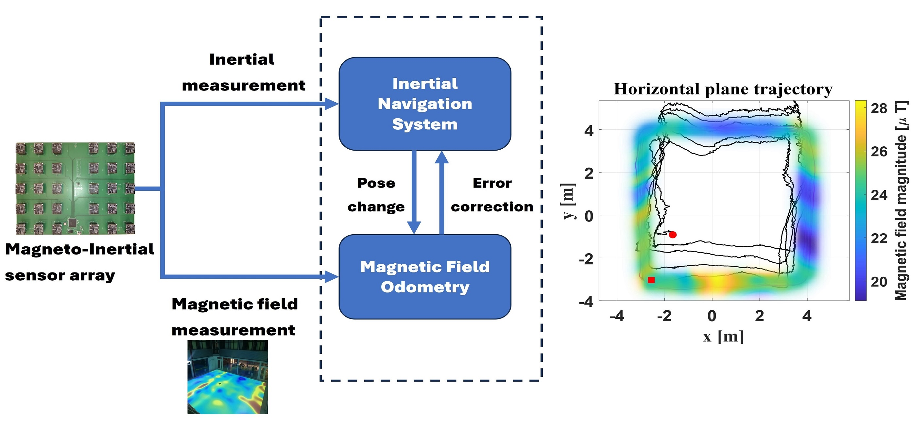

# MAINS: A Magnetic Field Aided Inertial Navigation System for Indoor Positioning

## Description




This repository contains the implementation of the MAINS algorithm for the paper [MAINS: A Magnetic Field Aided Inertial Navigation System for Indoor Positioning](https://arxiv.org/abs/2312.02599). The proposed method is compared with the state-of-the-art method magnetic field gradient-based EKF from the paper [Magnetic Field Gradient-Based EKF for Velocity Estimation in Indoor Navigation](https://hal.science/hal-03138331/document). 

The implementation of MAINS is in the directory `MAINS` and the implementation of magnetic field gradient-based EKF is in the directory `MAGEKF`. The data used for the experiments is in the directory `data`.

## License
Please see the file LICENSE for details.

## Usage

Install
```
git clone --recurse-submodules https://github.com/Huang-Chuan/MAINSvsMAGEKF.git
```

Run `main.m` to see the results of the experiments. The results are saved in the directory `results`.

The MAINS algorithm can also run independently by running `main1.m` in the directory `MAINS`. The config file `config.json` can be used to change the parameters of the algorithm.

## Credits

The authors thank Hassen Fourati and Christophe Prieur of the University Grenoble Alpes for sharing their implementation of `MAGEKF`.

## Citation

If you are using MAINS for academic work, please use the following citation:

```bibtex
@article{huang2024mains,
  title={MAINS: A Magnetic Field Aided Inertial Navigation System for Indoor Positioning},
  author={Huang, Chuan and Hendeby, Gustaf and Fourati, Hassen and Prieur, Christophe and Skog, Isaac},
  journal={IEEE Sensors Journal},
  year={2024},
  publisher={IEEE}
}
```
